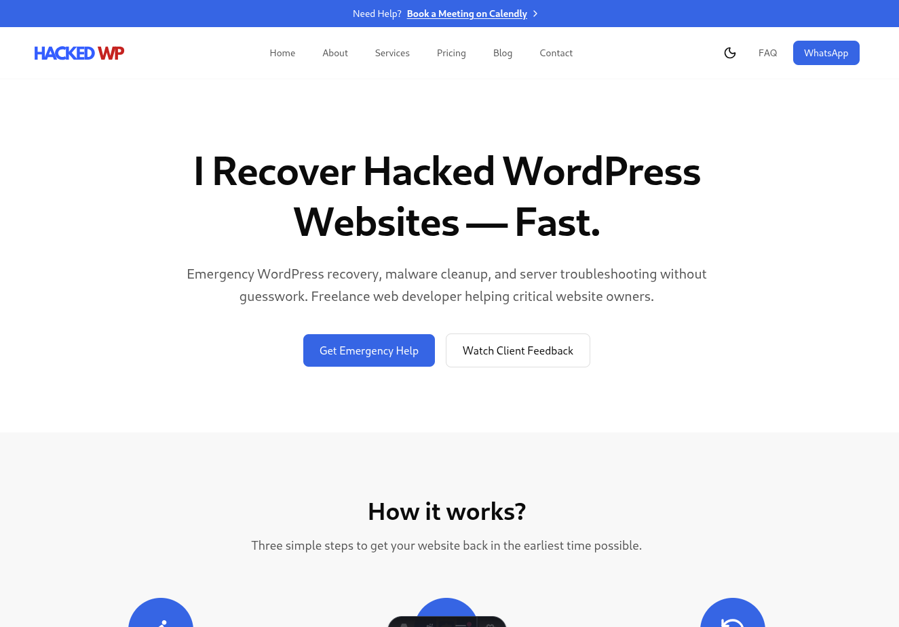

# HackedWP — Cybersecurity & WordPress Security Website

A modern cybersecurity and WordPress security website built with Astro and Tailwind CSS.

This project was customized and deployed for a real-world production use case, focusing on performance, responsive design, clean UI, and SEO optimization.

## Live Website

https://hackedwp.com/

## Preview



---

## Features

- Built with Astro
- Tailwind CSS styling
- Fully responsive layout
- SEO optimized
- Fast performance
- Modern SaaS-style UI
- Reusable components
- Dark mode support
- Optimized images and assets
- Production deployment

---

## Tech Stack

- Astro
- TypeScript
- Tailwind CSS
- Markdown / MDX

---

## Project Goals

The goal of this project was to create a modern and trustworthy cybersecurity website experience with:

- Clean user interface
- Fast loading speed
- Strong visual hierarchy
- Responsive design across devices
- Easy customization and scalability

---

## Development

Clone the repository:

```bash
git clone https://github.com/shihabiiuc/hackedwp.git
```